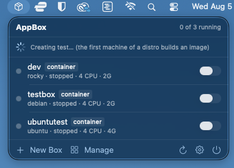

# AppBox

**Persistent Linux machines on Apple Silicon, from your menu bar.**

A native macOS app and CLI built on Apple's
[`container`](https://github.com/apple/container) tool. A *box* is a named,
persistent Linux machine — closer to WSL than to a Docker container.

Every box comes as a **full Linux install**: the standard CLI toolset, an
account matching your Mac user with passwordless sudo, a bash login shell and
dotfiles. Files you create in Linux belong to you on the Mac and vice versa.

A persistent icon by the clock lists every box with its running state and a
switch to flip it on or off. Create, provision, inspect and destroy boxes from a
management window, and open a real shell in Terminal with one click.

Since 0.3, AppBox drives Apple's **container machines** as well as its own
containers, and machines are the default. A machine runs the image's own init
system, so `systemctl enable --now nginx` works and comes back after a restart,
and your Mac home is mounted inside at `/Users/<you>` — edit on the Mac, build
in Linux, the same files rather than a copy. AppBox adds what a bare machine
lacks: a distro picker that only offers images that actually run on arm64, an
init system baked into images that ship without one, the standard toolset, sudo,
bash and a furnished home.

<p align="center">
  
</p>

<p align="center">
  <em>Every box, its state, and a switch — without leaving what you were doing.<br>
  Machines and classic containers in one list; the badge marks the exception.</em>
</p>

---

## Screenshots

### Create a box


Pick a distribution and version, then the **kind**: a machine, or a classic
container. Each choice explains itself, including how your Mac home is
mounted — read/write, read-only, or not at all. **Full Linux install** is on by
default: the standard toolset and an init system, plus sudo, a bash login shell
and dotfiles for the account Linux creates for you.

The version field adapts per distribution — it tells you Ubuntu's `latest`
means the newest LTS, and that Rocky has no `latest` tag at all.



The first machine of a distro builds a cached image — most images have no init
system and cannot boot as a machine without one. Every later machine of that
distro is created in seconds.

### Manage everything


Per-box detail, adapted to what the box actually is. A machine shows the image
it was built from, its IP, how much disk it really occupies, your Mac home with
a reveal-in-Finder button, the separate Linux home on the machine's own disk,
and whether it is the default machine. A container shows its persistent home
and `/data` instead. The console below carries the boot log — a real systemd
boot, on a machine.

### Open a real shell


**Open Shell** starts the box if needed and drops you into a real Terminal
window as your own user — not as root. On a machine you land in your Mac home,
mounted at the same path inside, so the files you were just editing are right
there. Your profile, your scrollback, no embedded-terminal compromises.

---

## Two kinds of box

|  | Machine *(default)* | Container |
|---|---|---|
| Init system | the image's own — systemd where it has one | none (`sleep infinity`) |
| Services | `systemctl` works, survives restart | start daemons by hand |
| Your Mac home | mounted at `/Users/<you>`, shared by every machine | not mounted |
| Private home | no — `/home/<you>` dies with the machine | yes, kept on the host |
| `/data` | no | yes, kept on the host |
| Survives destroy | nothing (your Mac home is untouched) | home and `/data` |
| Needs | `container` 1.1.0+ | any `container` |

Machines are what AppBox's containers were always imitating, and Apple does it
better. Create a container when you specifically want the isolated home or
`/data`: `appbox create dev ubuntu --container`, or the Kind picker in the New
Box window. Existing boxes keep working exactly as before and are listed
alongside machines with a `container` badge.

## Requirements

- **Apple Silicon Mac** (M1 or later) running **macOS 15 or newer**
- **Apple's `container` CLI** — install the signed `.pkg` from
  [github.com/apple/container/releases](https://github.com/apple/container/releases).
  There is no Homebrew cask. AppBox drives this tool; it is not optional.
  **1.1.0 or newer** for machines; on anything older AppBox creates containers
  and hides the choice.

To build from source you also need **Xcode 26 / Swift 6**.

## Install

Download `AppBox-0.3.0.dmg` from the
[latest release](https://github.com/brainchillz/Appbox-Native/releases/latest),
open it, and drag **AppBox** to Applications.

The app is signed with a Developer ID certificate and notarized by Apple, so it
opens normally — no Gatekeeper warning and nothing to work around.

### Install the command line tool

Open the app, click the menu bar icon → gear icon → **Install**. This symlinks
the `appbox` CLI (which ships inside the app bundle) onto your `PATH`.

Do this **after** moving the app to /Applications — the symlink points at the
app's location at install time, and the app warns you if you install while
running from somewhere else.

The installer shows every `appbox` on your `PATH` in the order your shell
resolves them, so a shadowed install is visible rather than mysterious. If an
existing `appbox` is in the way it is moved to `appbox.previous`, never deleted.

## Using it

### Menu bar

Click the icon for the box list. Each row has a state dot, the distro, IP and
resources, and an on/off switch. Click a row to open a shell. Hover for a menu
with Follow Logs, Restart, Install Standard Toolset and Destroy.

**Install Standard Toolset** ("provision") installs about 28 packages that base
images don't ship — `curl`, `git`, `vim`, `sudo`, `dig`, `ip`, `htop`, `tmux`,
`jq`, `tree`, `rsync`, `less`, `man` and friends. A fresh Ubuntu or Alpine box
doesn't even have `curl` or `ping`. It's idempotent, so it's safe to re-run.

### CLI

```
appbox create        <name> [image|distro]            # uses your default distro if none given
appbox create-ubuntu <name> [24.04|26.04|latest]      # latest = newest LTS
appbox create-debian <name> [version|latest]
appbox create-alpine <name> [version|latest]
appbox create-fedora <name> [43|44|latest]
appbox create-rocky  <name> [9|10|latest]             # latest = 10
appbox create-arch   <name>                           # rolling — always latest

  --container            make a classic box instead of a machine
  --home-mount rw|ro|none    machines: how your Mac home is mounted
  --default              machines: make this the default machine
  --bare                 skip the toolset and account setup
  --cpus N --memory 8G

appbox set-default   [distro|--clear]   # distro used by a bare `create`
appbox provision     <name>             # toolset, and on a machine sudo/bash/dotfiles
appbox shell         <name> [--root]    # interactive shell (auto-starts the box)
appbox exec          [--root] <name> <cmd...>
appbox use           <name>             # machines: make it the default
appbox set           <name> [--cpus N] [--memory 8G] [--home-mount ro]
appbox start|stop|restart|list|ip|info|destroy <name>
```

Boxes are fully provisioned by default; pass `--bare` for the image as it
shipped. The version and name may be given in **either order** —
`create-ubuntu web 24.04` and `create-ubuntu 24.04 web` are equivalent.

Flags come before the box name on `exec`; everything after the name is passed
through untouched, quoting included:

```sh
appbox exec dev 'systemctl is-active nginx'
appbox exec --root dev 'apt-get install -y postgresql'
```

`appbox list` shows both kinds, with a `*` against the default machine.

A bare `appbox create <name>` does not silently pick a distro. It uses
`$APPBOX_IMAGE`, then the distro saved by `set-default`, and otherwise prints a
menu and exits.

### Configuration

| Variable | Default | Meaning |
|---|---|---|
| `APPBOX_HOME` | `~/containers` | per-box host data |
| `APPBOX_IMAGE` | *(unset)* | forces the image for a bare `create` |
| `APPBOX_CONFIG_DIR` | `~/.config/appbox` | AppBox's own config |
| `APPBOX_CPUS` | `4` | default CPUs |
| `APPBOX_MEMORY` | `2G` | default memory |
| `APPBOX_DEFAULT_DISTRO` | *(unset)* | overrides the saved default |
| `APPBOX_CONTAINER_BIN` | *(auto)* | explicit path to `container` |

## Distributions

| Distro | Image | Package manager |
|---|---|---|
| Ubuntu | `ubuntu:latest` (newest LTS) | apt |
| Debian | `debian:latest` | apt |
| Alpine | `alpine:latest` | apk |
| Fedora | `fedora:latest` | dnf |
| Rocky Linux | `quay.io/rockylinux/rockylinux:{10,9}` | dnf |
| Arch Linux ARM | `menci/archlinuxarm:base` (rolling) | pacman |

Any other value is passed through as a raw image reference, so
`appbox create tiny busybox:latest` works too.

## What persists

**Machines:**

| | Survives stop/start | Survives destroy |
|---|---|---|
| Everything inside, including installed packages and services | yes | no |
| `/home/<you>` — on the machine's own disk | yes | no |
| `/Users/<you>` — your Mac home, mounted in | yes | **yes** — it's on the Mac |

A machine's disk always goes when the machine does; there is no keeping it. That
is not the loss it sounds like, because the files you care about live in your
Mac home, which was mounted rather than copied. Work there and a destroyed
machine costs you installed packages, not your work.

The flip side is that every machine sees that same one home, with no isolation
between them — `rm -rf ~` inside reaches your real files. Create a machine with
`--home-mount ro` (or `none`) when that matters.

**Containers:**

| | Survives stop/start | Survives destroy |
|---|---|---|
| Everything inside the box | yes | no |
| `/home/<you>` → `$APPBOX_HOME/<name>/home` | yes | **yes** |
| `/data` → `$APPBOX_HOME/<name>/data` | yes | **yes** |

So you can `destroy` a container and recreate it on a newer distro release, or
with different CPU and memory, and your dotfiles, keys, shell history and
checkouts come back with it. `--purge` deletes the host directories too.

Either way your Linux account is created at your Mac account's uid and gid,
which is what makes the shared directories behave — a file written inside is
owned by you on the Mac, with no permission juggling.

## Caveats

Please read these — several are inherited from Apple's `container` and are not
things AppBox can fix.

**Containers have no systemd.** A container runs an init process parked on
`sleep infinity`, so systemd-dependent services — auto-starting sshd, cron,
`systemctl` — are not supported there. Attach with `appbox shell` and launch
daemons manually. Machines do not have this limitation.

**Machines can't mount anything but your home.** Apple's `machine create` takes
no `--volume`, so there is no `/data` and no private per-box home. If you need
either, create a container.

**Machines take a minute the first time you use a distro.** Most images have no
init system and cannot boot as a machine at all, so AppBox builds one — the
upstream image plus an init system and the toolset — and caches it as
`appbox-machine/<distro>`. Every later machine of that distro is created in
seconds.

**IP addresses are DHCP** and can change when a box restarts. Use the box name
or `appbox ip <name>`; never hardcode an address.

**CLI/daemon version skew breaks networking.** After upgrading Apple's
`container` CLI, the old daemon keeps running and networking fails with
`no available interface strategy for network default … variant=nil`. AppBox
detects this and offers to restart the service; by hand it is
`container system stop && container system start`.

**`htop` is unavailable on Rocky.** It ships in EPEL, which Rocky's default
repositories don't include. Provisioning skips packages it can't find rather
than failing, so everything else installs.

**The official Arch image is amd64-only** and will not run on Apple Silicon.
`create-arch` uses Arch Linux ARM, which is rolling-release and ignores any
version argument. If you run `pacman` manually inside a box, add
`--disable-sandbox` — pacman 7's downloader sandbox uses Landlock, which the
container kernel does not support.

**Rocky publishes no `latest` tag**, so `latest` resolves to the newest major
(10).

**`$HOME` inside a machine is not your Mac home.** `/home/<you>` is a real Linux
home on the machine's own disk; your Mac home is mounted separately at
`/Users/<you>`. Apple's container-machine documentation says `pwd` lands you in
your Mac home — it does not.

**`id` may report an odd group name.** Your box user takes your Mac gid (20),
which most distributions already use for something else — Debian, Ubuntu and
Alpine all call it `dialout`. Ownership is numeric and correct; only the label
differs, and renaming a system group would be worse.

**A box name starting with a digit** will be read as a version by the
`create-<distro>` commands, because they accept the name and version in either
order.

**Arm64 only.** Everything runs as arm64; Intel Macs are not supported.

## Build from source

```sh
git clone https://github.com/brainchillz/Appbox-Native.git
cd Appbox-Native

swift build && swift test        # the engine and CLI
./build-app.sh --release         # -> build/AppBox.app
./build-app.sh --debug --run     # fast build, then launch
./package.sh                     # -> dist/AppBox-<version>.dmg
```

There is no `.xcodeproj` — SPM builds the executables and `build-app.sh`
assembles the bundle, so the whole project builds from the terminal.

`package.sh` adapts to whatever signing is available: it uses a Developer ID
certificate with the hardened runtime when one exists, and falls back to an
ad-hoc signature when it doesn't. With a certificate installed,
`./package.sh --notarize` also submits to Apple and staples the ticket.

Builds made without a Developer ID certificate are ad-hoc signed. Those run
fine locally, but if you transfer one to another Mac by any route that sets the
quarantine flag, the recipient needs
`xattr -dr com.apple.quarantine /Applications/AppBox.app`. Released builds are
notarized and need none of this.

The app cannot be sandboxed — it spawns processes and reads `~/containers` — so
there is no Mac App Store path.

## How it's put together

`AppBoxKit` holds all the logic; the CLI and the app are thin layers over it, so
the two interfaces cannot drift apart. See
[ARCHITECTURE.md](ARCHITECTURE.md) for the design rules and the platform facts
behind them.

Boxes created by AppBox are labelled `appbox.managed`, so the app can tell them
apart from other containers on the machine. Boxes created by the earlier bash
version have no labels and are recognised by shape instead, so they keep working
untouched.

## Status

Early but functional. Working: the menu bar list with live state and toggles,
create, provision, destroy, shell-in-Terminal, logs, service-health banners, CLI
installation, and the full command line interface — all of it across both
machines and containers. Boxes are full Linux installs with their own user
account.

Releases are signed with a Developer ID certificate and notarized by Apple.

Not done: SSH access and VS Code Remote, port publishing, export/import, and
auto-updates. Nested virtualization and custom kernels (`container machine`
supports both) are in the engine but not yet exposed.

## License

[MIT](LICENSE).
