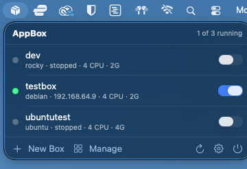
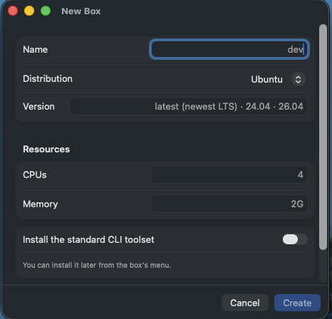
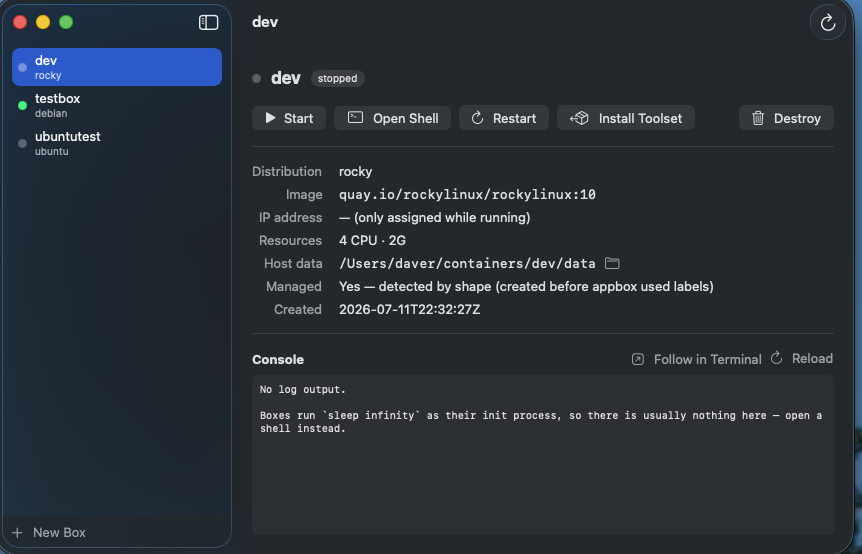
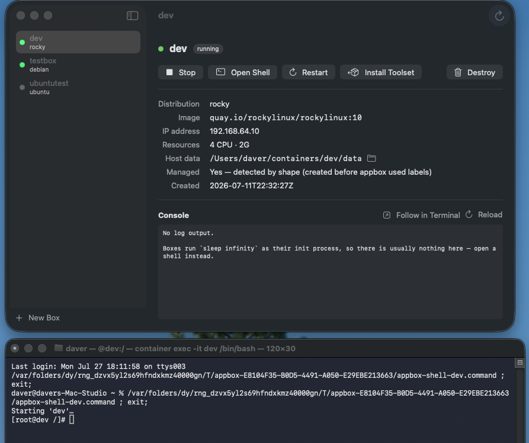

# AppBox

**LXC-style Linux containers on Apple Silicon, from your menu bar.**

A native macOS app and CLI built on Apple's
[`container`](https://github.com/apple/container) tool. A *box* is a named,
persistent Linux machine: you shell into it, install packages in it, and its
state survives stop/start. A host directory is bind-mounted at `/data`, so the
data you can't lose outlives the container itself.

A persistent icon by the clock lists every box with its running state and a
switch to flip it on or off. Create, provision, inspect and destroy boxes from a
management window, and open a real shell in Terminal with one click.

<p align="center">
  
</p>

<p align="center">
  <em>Every box, its state, and a switch — without leaving what you were doing.</em>
</p>

---

## Screenshots

### Create a box



Pick a distribution and version, set CPUs and memory, and optionally install the
standard CLI toolset up front. The version field adapts per distribution — it
tells you Ubuntu's `latest` means the newest LTS, and that Rocky has no `latest`
tag at all.

### Manage everything



Per-box detail: image reference, IP (only assigned while running), host data
directory with a reveal-in-Finder button, and a console pane. Note the *Managed*
row — this box was created by the older shell script and has no labels, so
AppBox recognised it by shape instead.

### Open a real shell



**Open Shell** starts the box if needed and drops you into a real Terminal
window — your own profile, your own scrollback, no embedded-terminal
compromises.

---

## Requirements

- **Apple Silicon Mac** (M1 or later) running **macOS 15 or newer**
- **Apple's `container` CLI** — install the signed `.pkg` from
  [github.com/apple/container/releases](https://github.com/apple/container/releases).
  There is no Homebrew cask. AppBox drives this tool; it is not optional.

To build from source you also need **Xcode 26 / Swift 6**.

## Install

Download `AppBox-0.1.1.dmg` from the
[latest release](https://github.com/brainchillz/Appbox-Native/releases/latest),
open it, and drag **AppBox** to Applications.

The app is signed with a Developer ID certificate and notarized by Apple, so it
opens normally — no Gatekeeper warning and nothing to work around.

### Install the command line tool

Open the app, click the menu bar icon → gear icon → **Install**. This symlinks
the `appbox` CLI (which ships inside the app bundle) onto your `PATH`.

Do this **after** moving the app to /Applications — the symlink points at the
app's location at install time, and the app warns you if you install while
running from somewhere else.

The installer shows every `appbox` on your `PATH` in the order your shell
resolves them, so a shadowed install is visible rather than mysterious. If an
existing `appbox` is in the way it is moved to `appbox.previous`, never deleted.

## Using it

### Menu bar

Click the icon for the box list. Each row has a state dot, the distro, IP and
resources, and an on/off switch. Click a row to open a shell. Hover for a menu
with Follow Logs, Restart, Install Standard Toolset and Destroy.

**Install Standard Toolset** ("provision") installs about 28 packages that base
images don't ship — `curl`, `git`, `vim`, `sudo`, `dig`, `ip`, `htop`, `tmux`,
`jq`, `tree`, `rsync`, `less`, `man` and friends. A fresh Ubuntu or Alpine box
doesn't even have `curl` or `ping`. It's idempotent, so it's safe to re-run.

### CLI

```
appbox create        <name> [image|distro] [--full]   # uses your default distro if none given
appbox create-ubuntu <name> [24.04|26.04|latest]      # latest = newest LTS
appbox create-debian <name> [version|latest]
appbox create-alpine <name> [version|latest]
appbox create-fedora <name> [43|44|latest]
appbox create-rocky  <name> [9|10|latest]             # latest = 10
appbox create-arch   <name>                           # rolling — always latest

appbox set-default   [distro|--clear]   # distro used by a bare `create`
appbox provision     <name>             # install the standard toolset
appbox shell         <name>             # interactive shell (auto-starts the box)
appbox exec          <name> <cmd...>
appbox start|stop|restart|list|ip|info|destroy <name>
```

`--full` on any create command also installs the standard toolset. The version
and name may be given in **either order** — `create-ubuntu web 24.04` and
`create-ubuntu 24.04 web` are equivalent.

A bare `appbox create <name>` does not silently pick a distro. It uses
`$APPBOX_IMAGE`, then the distro saved by `set-default`, and otherwise prints a
menu and exits.

### Configuration

| Variable | Default | Meaning |
|---|---|---|
| `APPBOX_HOME` | `~/containers` | per-box host data |
| `APPBOX_IMAGE` | *(unset)* | forces the image for a bare `create` |
| `APPBOX_CONFIG_DIR` | `~/.config/appbox` | AppBox's own config |
| `APPBOX_CPUS` | `4` | default CPUs |
| `APPBOX_MEMORY` | `2G` | default memory |
| `APPBOX_DEFAULT_DISTRO` | *(unset)* | overrides the saved default |
| `APPBOX_CONTAINER_BIN` | *(auto)* | explicit path to `container` |

## Distributions

| Distro | Image | Package manager |
|---|---|---|
| Ubuntu | `ubuntu:latest` (newest LTS) | apt |
| Debian | `debian:latest` | apt |
| Alpine | `alpine:latest` | apk |
| Fedora | `fedora:latest` | dnf |
| Rocky Linux | `quay.io/rockylinux/rockylinux:{10,9}` | dnf |
| Arch Linux ARM | `menci/archlinuxarm:base` (rolling) | pacman |

Any other value is passed through as a raw image reference, so
`appbox create tiny busybox:latest` works too.

## Caveats

Please read these — several are inherited from Apple's `container` and are not
things AppBox can fix.

**No systemd.** Boxes run an init process parked on `sleep infinity`, so
systemd-dependent services — auto-starting sshd, cron, `systemctl` — are not
supported. Attach with `appbox shell` and launch daemons manually.

**IP addresses are DHCP** and can change when a box restarts. Use the box name
or `appbox ip <name>`; never hardcode an address.

**CLI/daemon version skew breaks networking.** After upgrading Apple's
`container` CLI, the old daemon keeps running and networking fails with
`no available interface strategy for network default … variant=nil`. AppBox
detects this and offers to restart the service; by hand it is
`container system stop && container system start`.

**`htop` is unavailable on Rocky.** It ships in EPEL, which Rocky's default
repositories don't include. Provisioning skips packages it can't find rather
than failing, so everything else installs.

**The official Arch image is amd64-only** and will not run on Apple Silicon.
`create-arch` uses Arch Linux ARM, which is rolling-release and ignores any
version argument. If you run `pacman` manually inside a box, add
`--disable-sandbox` — pacman 7's downloader sandbox uses Landlock, which the
container kernel does not support.

**Rocky publishes no `latest` tag**, so `latest` resolves to the newest major
(10).

**A box name starting with a digit** will be read as a version by the
`create-<distro>` commands, because they accept the name and version in either
order.

**Arm64 only.** Everything runs as arm64; Intel Macs are not supported.

## Build from source

```sh
git clone https://github.com/brainchillz/Appbox-Native.git
cd Appbox-Native

swift build && swift test        # the engine and CLI
./build-app.sh --release         # -> build/AppBox.app
./build-app.sh --debug --run     # fast build, then launch
./package.sh                     # -> dist/AppBox-<version>.dmg
```

There is no `.xcodeproj` — SPM builds the executables and `build-app.sh`
assembles the bundle, so the whole project builds from the terminal.

`package.sh` adapts to whatever signing is available: it uses a Developer ID
certificate with the hardened runtime when one exists, and falls back to an
ad-hoc signature when it doesn't. With a certificate installed,
`./package.sh --notarize` also submits to Apple and staples the ticket.

Builds made without a Developer ID certificate are ad-hoc signed. Those run
fine locally, but if you transfer one to another Mac by any route that sets the
quarantine flag, the recipient needs
`xattr -dr com.apple.quarantine /Applications/AppBox.app`. Released builds are
notarized and need none of this.

The app cannot be sandboxed — it spawns processes and reads `~/containers` — so
there is no Mac App Store path.

## How it's put together

`AppBoxKit` holds all the logic; the CLI and the app are thin layers over it, so
the two interfaces cannot drift apart. See
[ARCHITECTURE.md](ARCHITECTURE.md) for the design rules and the platform facts
behind them.

Boxes created by AppBox are labelled `appbox.managed`, so the app can tell them
apart from other containers on the machine. Boxes created by the earlier bash
version have no labels and are recognised by shape instead, so they keep working
untouched.

## Status

Early but functional. Working: the menu bar list with live state and toggles,
create, provision, destroy, shell-in-Terminal, logs, service-health banners, CLI
installation, and the full command line interface.

Releases are signed with a Developer ID certificate and notarized by Apple.

Not done: auto-updates and an embedded terminal.

## License

[MIT](LICENSE).
